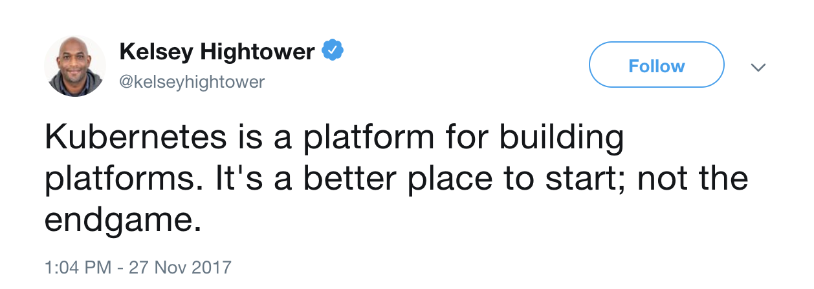

# Kubernetes Shallow Dive

We all probably heard of Kubernetes. If we did not hear about it yet we will.

_**Kubernetes is a portable, extensible open-source platform for managing containerized workloads and services, that facilitates both declarative configuration and automation. It has a large, rapidly growing ecosystem. Kubernetes services, support, and tools are widely available.**_

Thats the definition of Kubernetes from the Kubernetes official documentation.

Honestly that is not super clear what Kubernetes is from that documentation. And the reason it is not clear is because Kubernetes is many things. Its a container platform, a microservices platform a portable cloud platform and so much more.

As Kelsey Hightower so very aptly put

Kubernetes is an abstraction on the infrastructure that helps automate many important but mundane and labor intensive work that was being done by many teams across the industry over and over and over again. K8s \(Short for Kubernetes\) gives a great starting point for most people and gives a way to standardize best practices across the industry. What most people don’t even realize is that K8s is making the skills of platform and system engineers portable across industries and companies as well as making it easy for companies to find talent.

I still don’t think I am anywhere closer to defining what K8s actually is. I don’t think there is a short and concise definition for it. Instead lets talk about how K8s came to be, what it is made of and what problems it solves and maybe we will have a clearer view about the purpose of K8s.

## Why do I need Kubernetes and what can it do?

Kubernetes has a number of features. It can be thought of as:

* a container platform
* a microservices platform
* a portable cloud platform and a lot more.

Kubernetes provides a **container-centric** management environment. It orchestrates computing, networking, and storage infrastructure on behalf of user workloads. This provides much of the simplicity of Platform as a Service \(PaaS\) with the flexibility of Infrastructure as a Service \(IaaS\), and enables portability across infrastructure providers.

## What Kubernetes is not

Kubernetes is not a traditional, all-inclusive PaaS \(Platform as a Service\) system. Since Kubernetes operates at the container level rather than at the hardware level, it provides some generally applicable features common to PaaS offerings, such as deployment, scaling, load balancing, logging, and monitoring. However, Kubernetes is not monolithic, and these default solutions are optional and pluggable. Kubernetes provides the building blocks for building developer platforms, but preserves user choice and flexibility where it is important. Kubernetes:

* Does not limit the types of applications supported. Kubernetes aims to support an extremely diverse variety of workloads, including stateless, stateful, and data-processing workloads. If an application can run in a container, it should run great on Kubernetes.
* Does not deploy source code and does not build your application. Continuous Integration, Delivery, and Deployment \(CI/CD\) workflows are determined by organization cultures and preferences as well as technical requirements.
* Does not provide application-level services, such as middleware \(e.g., message buses\), data-processing frameworks \(for example, Spark\), databases \(e.g., mysql\), caches, nor cluster storage systems \(e.g., Ceph\) as built-in services. Such components can run on Kubernetes, and/or can be accessed by applications running on Kubernetes through portable mechanisms, such as the Open Service Broker.
* Does not dictate logging, monitoring, or alerting solutions. It provides some integrations as proof of concept, and mechanisms to collect and export metrics.
* Does not provide nor mandate a configuration language/system \(e.g., [jsonnet](https://github.com/google/jsonnet)\). It provides a declarative API that may be targeted by arbitrary forms of declarative specifications.
* Does not provide nor adopt any comprehensive machine configuration, maintenance, management, or self-healing systems.

Additionally, Kubernetes is not a mere _orchestration system_. In fact, it eliminates the need for orchestration. The technical definition of _orchestration_ is execution of a defined workflow: first do A, then B, then C. In contrast, Kubernetes is comprised of a set of independent, composable control processes that continuously drive the current state towards the provided desired state. It shouldn’t matter how you get from A to C. Centralized control is also not required. This results in a system that is easier to use and more powerful, robust, resilient, and extensible.

## Why containers

Looking for reasons why you should be using containers

The _Old Way_ to deploy applications was to install the applications on a host using the operating-system package manager. This had the disadvantage of entangling the applications’ executables, configuration, libraries, and lifecycles with each other and with the host OS. One could build immutable virtual-machine images in order to achieve predictable rollouts and rollbacks, but VMs are heavyweight and non-portable. The _New Way_ is to deploy containers based on operating-system-level virtualization rather than hardware virtualization. These containers are isolated from each other and from the host: they have their own filesystems, they can’t see each others’ processes, and their computational resource usage can be bounded. They are easier to build than VMs, and because they are decoupled from the underlying infrastructure and from the host filesystem, they are portable across clouds and OS distributions. Because containers are small and fast, one application can be packed in each container image. This one-to-one application-to-image relationship unlocks the full benefits of containers. With containers, immutable container images can be created at build/release time rather than deployment time, since each application doesn’t need to be composed with the rest of the application stack, nor married to the production infrastructure environment. Generating container images at build/release time enables a consistent environment to be carried from development into production. Similarly, containers are vastly more transparent than VMs, which facilitates monitoring and management. This is especially true when the containers’ process lifecycles are managed by the infrastructure rather than hidden by a process supervisor inside the container. Finally, with a single application per container, managing the containers becomes tantamount to managing deployment of the application. Summary of container benefits:

* **Agile application creation and deployment**: Increased ease and efficiency of container image creation compared to VM image use.
* **Continuous development, integration, and deployment**: Provides for reliable and frequent container image build and deployment with quick and easy rollbacks \(due to image immutability\).
* **Dev and Ops separation of concerns**: Create application container images at build/release time rather than deployment time, thereby decoupling applications from infrastructure.
* **Observability** Not only surfaces OS-level information and metrics, but also application health and other signals.
* **Environmental consistency across development, testing, and production**: Runs the same on a laptop as it does in the cloud.
* **Cloud and OS distribution portability**: Runs on Ubuntu, RHEL, CoreOS, on-prem, Google Kubernetes Engine, and anywhere else.
* **Application-centric management**: Raises the level of abstraction from running an OS on virtual hardware to running an application on an OS using logical resources.
* **Loosely coupled, distributed, elastic, liberated** [**micro-services**](https://martinfowler.com/articles/microservices.html): Applications are broken into smaller, independent pieces and can be deployed and managed dynamically – not a monolithic stack running on one big single-purpose machine.
* **Resource isolation**: Predictable application performance.
* **Resource utilization**: High efficiency and density.

### 

## Kubernetes architecture

At its core, Kubernetes is a data store \(etcd\). The declarative model is stored in the data store as objects, that means when you say I want 5 instances of a container then that request is stored into the data store. This information change is watched and delegated to Controllers to take action. Controllers then react to the model and attempt to take action to achieve the desired state. The power of Kubernetes is in its simplistic model. As shown, API server is a simple HTTP server handling create/read/update/delete\(CRUD\) operations on the data store. Then the controller picks up the change you wanted and makes that happen. Controllers are responsible for instantiating the actual resource represented by any Kubernetes resource. These actual resources are what your application needs to allow it to run successful

## Kubernetes resource model

Kubernetes Infrastructure defines a resource for every purpose. Each resource is monitored and processed by a controller. When you define your application, it contains a collection of these resources. This collection will then be read by Controllers to build your applications actual backing instances. Some of resources that you may work with are listed below for your reference, for a full list you should go to [https://kubernetes.io/docs/concepts/](https://kubernetes.io/docs/concepts/). In this class we will only use a few of them, like Pod, Deployment, etc.

* Config Maps holds configuration data for pods to consume.
* Daemon Sets ensure that each node in the cluster runs this Pod
* Deployments defines a desired state of a deployment object
* Events provides lifecycle events on Pods and other deployment objects
* Endpoints allows a inbound connections to reach the cluster services
* Ingress is a collection of rules that allow inbound connections to reach the cluster services
* Jobs creates one or more pods and as they complete successfully the job is marked as completed.
* Node is a worker machine in Kubernetes
* Namespaces are multiple virtual clusters backed by the same physical cluster
* Pods are the smallest deployable units of computing that can be created and managed in Kubernetes
* Persistent Volumes provides an API for users and administrators that abstracts details of how storage is provided from how it is consumed
* Replica Sets ensures that a specified number of pod replicas are running at any given time
* Secrets are intended to hold sensitive information, such as passwords, OAuth tokens, and ssh keys
* Service Accounts provides an identity for processes that run in a Pod
* Services is an abstraction which defines a logical set of Pods and a policy by which to access them - sometimes called a micro-service.
* Stateful Sets is the workload API object used to manage stateful applications.
* and more...

## Hardware

### **Node**

A [node](https://kubernetes.io/docs/concepts/architecture/nodes/) is the smallest unit of computing hardware in Kubernetes. It is a representation of a single machine in your cluster. In most production systems, a node will likely be either a physical machine in a datacenter, or virtual machine hosted on a cloud provider like [Google Cloud Platform](https://cloud.google.com/). Don’t let conventions limit you, however; in theory, you can make a node out of [almost](https://twitter.com/jkrippy/status/932800484703862784) [anything](https://blog.hypriot.com/post/setup-kubernetes-raspberry-pi-cluster/). Thinking of a machine as a “node” allows us to insert a layer of abstraction. Now, instead of worrying about the unique characteristics of any individual machine, we can instead simply view each machine as a set of CPU and RAM resources that can be utilized. In this way, any machine can substitute any other machine in a Kubernetes cluster.

### **The Cluster**

Although working with individual nodes can be useful, it’s not the Kubernetes way. In general, you should think about the cluster as a whole, instead of worrying about the state of individual nodes. In Kubernetes, nodes pool together their resources to form a more powerful machine. When you deploy programs onto the cluster, it intelligently handles distributing work to the individual nodes for you. If any nodes are added or removed, the cluster will shift around work as necessary. It shouldn’t matter to the program, or the programmer, which individual machines are actually running the code. If this kind of hivemind-like system reminds you of the [Borg from Star Trek](http://memory-alpha.wikia.com/wiki/Borg), you’re not alone; “Borg” is the name for the [internal Google project](http://blog.kubernetes.io/2015/04/borg-predecessor-to-kubernetes.html)Kubernetes was based on.

**Persistent Volumes** Because programs running on your cluster aren’t guaranteed to run on a specific node, data can’t be saved to any arbitrary place in the file system. If a program tries to save data to a file for later, but is then relocated onto a new node, the file will no longer be where the program expects it to be. For this reason, the traditional local storage associated to each node is treated as a temporary cache to hold programs, but any data saved locally can not be expected to persist

To store data permanently, Kubernetes uses [Persistent Volumes](https://kubernetes.io/docs/concepts/storage/persistent-volumes/). While the CPU and RAM resources of all nodes are effectively pooled and managed by the cluster, persistent file storage is not. Instead, local or cloud drives can be attached to the cluster as a Persistent Volume. This can be thought of as plugging an external hard drive in to the cluster. Persistent Volumes provide a file system that can be mounted to the cluster, without being associated with any particular node.

## Software

### **Containers**

Programs running on Kubernetes are packaged as [Linux containers](https://www.docker.com/what-container). Containers are a widely accepted standard, so there are already many [pre-built images](https://hub.docker.com/explore/) that can be deployed on Kubernetes. Containerization allows you to create self-contained Linux execution environments. Any program and all its dependencies can be bundled up into a single file and then shared on the internet. Anyone can download the container and deploy it on their infrastructure with very little setup required. Creating a container can be done programmatically, allowing powerful [CI and CD](http://blog.sonatype.com/achieving-ci/cd-with-kubernetes) pipelines to be formed. Multiple programs can be added into a single container, but you should limit yourself to one process per container if at all possible. It’s better to have many small containers than one large one. If each container has a tight focus, updates are easier to deploy and issues are easier to diagnose.

### **Pod**

Unlike other systems you may have used in the past, Kubernetes doesn’t run containers directly; instead it wraps one or more containers into a higher-level structure called a [pod](https://kubernetes.io/docs/concepts/workloads/pods/pod/). Any containers in the same pod will share the same resources and local network. Containers can easily communicate with other containers in the same pod as though they were on the same machine while maintaining a degree of isolation from others. Pods are used as the unit of replication in Kubernetes. If your application becomes too popular and a single pod instance can’t carry the load, Kubernetes can be configured to deploy new replicas of your pod to the cluster as necessary. Even when not under heavy load, it is standard to have multiple copies of a pod running at any time in a production system to allow load balancing and failure resistance. Pods can hold multiple containers, but you should limit yourself when possible. Because pods are scaled up and down as a unit, all containers in a pod must scale together, regardless of their individual needs. This leads to wasted resources and an expensive bill. To resolve this, pods should remain as small as possible, typically holding only a main process and its tightly-coupled helper containers \(these helper containers are typically referred to as “side-cars”\).

### **Deployment**

Although pods are the basic unit of computation in Kubernetes, they are not typically directly launched on a cluster. Instead, pods are usually managed by one more layer of abstraction: the [deployment](https://kubernetes.io/docs/concepts/workloads/controllers/deployment/). A deployment’s primary purpose is to declare how many replicas of a pod should be running at a time. When a deployment is added to the cluster, it will automatically spin up the requested number of pods, and then monitor them. If a pod dies, the deployment will automatically re-create it. Using a deployment, you don’t have to deal with pods manually. You can just declare the desired state of the system, and it will be managed for you automatically.

### **Ingress**

\*\*\*\*

Using the concepts described above, you can create a cluster of nodes, and launch deployments of pods onto the cluster. There is one last problem to solve, however: allowing external traffic to your application. By default, Kubernetes provides isolation between pods and the outside world. If you want to communicate with a service running in a pod, you have to open up a channel for communication. This is referred to as ingress. There are multiple ways to add ingress to your cluster. The most common ways are by adding either an [Ingress](https://kubernetes.io/docs/concepts/services-networking/ingress/) controller, or a [LoadBalancer](https://kubernetes.io/docs/tasks/access-application-cluster/create-external-load-balancer/). The exact tradeoffs between these two options are out of scope for this post, but you must be aware that ingress is something you need to handle before you can experiment with Kubernetes.

