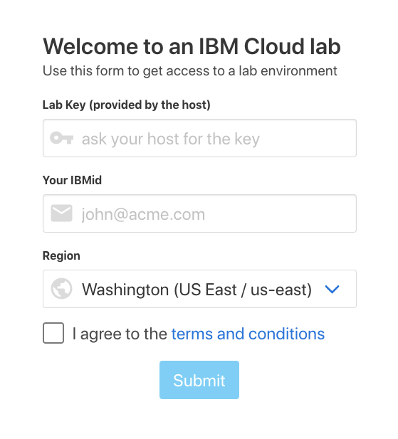

# Setup

## Setup Steps

In this section, you will create your own IBM Cloud account, and then get access to a IBM Cloud Lab account which contains pre-provisioned clusters. Each lab attendee will be granted access to one cluster.

## Create your IBM Cloud account <a id="create-your-ibm-cloud-account"></a>

​[Sign up for IBM Cloud](https://cloud.ibm.com/registration?cm_mmc=Email_Events-_-Developer_Innovation-_-WW_WW-_-Mofizur-Rahman/skrum/devopsdaysmidwest2019-stlouis-4152019-4162019/Apr2019/conference/global-devadvgrp/st.louis/unitedstates/cloud/containers/databases/java/microservices/node-js/paas/python/manage-microservices-traffic-using-istio&cm_mmca1=000019RS&cm_mmca2=10004805&cm_mmca3=M99938765&cvosrc=email.Events.M99938765&cvo_campaign=000019RS)​

## Get a Kubernetes Cluster <a id="get-a-kubernetes-cluster"></a>

Generally to get started with Kubernetes, the first step is to provision a cluster which can take up to 10 minutes. In addition, free clusters come with limited features and a single worker VM/node. For this workshop, we've created Standard \(paid\) clusters with full Kubernetes functionality.

To get a cluster, head to the [Get Cluster](https://devops-midwest-istio.mybluemix.net/) tool.

Use the key `istio_rocks_2019` and input the email you used to sign up for IBM Cloud. Ensure that US East is chosen as we've created clusters in the Washington data center for this lab.



## Clone The Repo

```text
git clone https://github.com/moficodes/app-to-k8s.git
```

